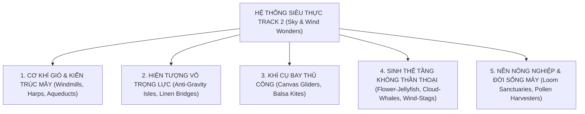

# ☁️ SỔ TAY ĐỊNH CHUẨN THỊ GIÁC — TRACK 2: SKY WITHOUT SHORES
**Phong Cách Thị Giác: Quần Đảo Làng Dệt Mây & Thảo Nguyên Gió Châu Âu**  
*Mã phong cách: `STYLE_cloud_weaver_windmills` | Áp dụng cho: Track 2 — `Sky Without Shores` (84 BPM, G Major)*  
*Định chuẩn nghệ thuật: Hoạt hình thủ công thu nhỏ (Handcrafted Tactile Diorama), Thuần văn hóa Dân gian Alpine / Dutch / Bắc Âu ($0\%$ Á Đông), $0\%$ Đồ Len*

---

## 🧭 I. TRIẾT LÝ NGHỆ THUẬT & TINH THẦN TỰ DO VÔ TẬN

> [!IMPORTANT]
> **"Sky Without Shores" (Bầu trời không bờ bến) là tuyên ngôn về sự tháo bỏ hoàn toàn xiềng xích phán xét và tiêu chuẩn gượng ép.**  
> Khung hình phải gợi mở sự **mênh mông, nhẹ bẫng, bao la và tự do tuyệt đối**, nơi ranh giới giữa mặt đất và tầng mây bị xóa nhòa.

---

## 🌌 II. 5 TRỤC SIÊU THỰC ĐA CHIỀU (EXPANSIVE SURREAL DIMENSIONS)
*Tuyệt đối không đóng khung vào 3-4 chi tiết đơn điệu. Thế giới Track 2 vận hành dựa trên 5 chiều kích siêu thực:*



### 1. Cơ Khí Gió & Kiến Trúc Tầng Mây (Wind Kinetic Architecture):
* **Tháp Đàn Hạc Gió (Aeolian Wind-Harp Towers):** Tháp gỗ tuyết tùng cao vút với những dây đàn bằng sợi tơ lanh dài căng giữa hai vách núi, tự ngân vang khúc nhạc êm dịu khi gió lộng thổi qua.
* **Cối Xay Gió Gặt Mây (Cloud-Harvesting Windmills):** Cánh buồm lanh dệt tay quay chậm rãi để gom những cụm mây trắng và kéo thành các cuộn sợi tơ trắng ngà.
* **Cầu Máng Mây (Cloud-Aqueducts):** Cầu máng bằng đá cuội và gỗ sồi dẫn những dòng mây bồng bềnh chảy quanh co qua các mái nhà như dòng suối sữa.
* **Cầu Thang Lên Trời (Sky-Stairs):** Cầu thang xoắn ốc bằng gỗ vươn từ mỏm núi cắm thẳng vào những đám mây hoàng hôn.
* **Ngọn Hải Đăng Mây (Cloud Lighthouses):** Tháp đá thắp đèn dầu sáp ong vàng ấm trên đỉnh núi đá trơ trọi chỉ đường cho các tàu lượn mộc.

### 2. Hiện Tượng Tự Nhiên & Địa Hình Vô Trọng Lực (Anti-Gravity & Scale Wonders):
* **Quần Đảo Đồi Cỏ Nổi (Floating Alpine Isles):** Những mỏm đồi cỏ xanh ngắt hình nón lơ lửng bồng bềnh giữa biển mây pastel đào và tím oải hương.
* **Cầu Dải Lanh Bay (Suspended Ribbon Bridges):** Những dải vải lanh dài hàng trăm mét trôi lơ lửng tự do trong không trung nối các ngọn đồi mà không cần cột chống.
* **Quả Cầu Mây Khổng Lồ (Floating Cloud Orbs):** Những khối mây tròn xoe trong vắt trôi lững lờ ngang hiên nhà, bên trong chứa những cánh hoa bồ công anh vàng.
* **Đồng Hồ Cát Phấn Hoa (Giant Pollen Hourglass):** Đặt trên mỏm đá ngắm biển mây, hạt phấn hoa bồ công anh rơi chậm rãi đếm nhịp thảnh thơi.

### 3. Phương Tiện Giao Thông Khí Cụ Thủ Công (Surreal Wind Crafts):
* **Tàu Lượn Gỗ Cánh Vải Bạt (Canvas-Winged Gliders):** Thân gỗ thông siêu nhẹ với cánh buồm bằng vải bạt lanh thô lướt êm ả trên luồng gió núi.
* **Khinh Khí Cầu Mây Liễu Mini (Wicker Cloud-Balloons):** Giỏ đan bằng mây liễu chở những chiếc đèn lồng giấy dầu bay lơ lửng giữa các hòn đảo nổi.
* **Xe Trượt Gió Cánh Buồm (Wind-Sledges):** Cỗ xe gỗ nhỏ gắn cánh buồm lanh lướt nhẹ trên thảm cỏ hoa cúc đẫm sương.

### 4. Sinh Thể Tầng Không Thần Thoại Vĩ Đại (Majestic Sky Fauna — $0\%$ Côn trùng):
* **Sứa Mây Cánh Hoa Ép (Pressed-Flower Sky-Jellyfish):** Mũ dù ghép từ cánh hoa mộc lan, cúc trắng và hoa dại ép khô tự nhiên, râu sứa bằng sợi tơ lanh phát sáng dịu dàng.
* **Cá Voi Mây Gỗ Tuyết Tùng (Cedar Cloud-Whale):** Bơi lướt uyển chuyển giữa các tầng mây hoàng hôn, lưng phủ rêu sồi xanh biếc.
* **Hươu Gió Thần Thoại (Wind-Stag):** Cặp sừng bằng cành gỗ sồi nở đầy hoa chuông trắng đứng sừng sững trên đỉnh mỏm đá ngắm biển mây.
* **Đàn Nhạn Tầng Không Cánh Vải (Linen Sky-Swallows):** Chao liệng thành đàn dẫn đường cho những đám mây trôi.

### 5. Đời Sống Nông Nghiệp & Thủ Công Vùng Mây (Cloud Pastoral Life):
* Các xưởng dệt khung cửi gỗ lộ thiên bên vách đá, nông dân chăn đàn cừu mây lông bông cotton, người thu hoạch phấn hoa bồ công anh, quán trà thảo mộc trên chòi gỗ ngắm bình minh mây.

---

## 👥 III. MA TRẬN NHÂN VẬT & TRANG PHỤC ĐA DẠNG ($0\%$ ĐƠN ĐIỆU)

> [!CAUTION]
> **CẤM TUYỆT ĐỐI chỉ dùng một nhân vật thiếu nữ tóc vàng váy yếm cho mọi prompt.**  
> Phải luân chuyển phong phú về thế hệ, giới tính, nghề nghiệp, kiểu tóc và trang phục thủ công tự nhiên.

### 1. Phổ Nhân Vật Toàn Diện:
| Nhóm Nhân Vật | Đặc Điểm Diện Mạo & Tóc | Trang Phục Thuần Tự Nhiên ($0\%$ Len, $0\%$ Á Đông) | Hoạt Động Điển Hình |
| :--- | :--- | :--- | :--- |
| **Cụ Già Nghệ Nhân / Lão Nông** | Slender elderly, tóc râu bạc tơ mềm, nét mặt hiền hậu phúc đức | Áo sơ mi lanh thô màu xám tro, gile da bò dập cúc gỗ, tạp dề vải bạt | Chăm sóc cối xay gió, tỉa hoa cúc, uống trà thảo mộc bên vách núi |
| **Thanh Niên / Thợ Gió / Lữ Khách** | Slender stylized young man, tóc xoăn nâu hạt dẻ/đen gợn sóng | Áo tunic cotton mộc xẻ cổ, quần corduroy ống rộng chần chỉ gai, gile canvas thô | Lái tàu lượn cánh bạt, kéo dây đàn hạc gió, dạo bước trên cầu lanh |
| **Thiếu Nữ Dệt Mây / Trồng Hoa** | Slender stylized young woman, tóc vàng bơ/nâu búi lọn tơ mềm/tết bím | Váy yếm lanh xanh xô thơm/trắng ngà, áo blouse cotton tay phồng, khăn choàng lanh | Dệt tơ mây bên khung cửi, hái hoa bồ công anh, ngắm sứa mây |
| **Trẻ Em Mục Đồng / Thả Diều** | Slender stylized children, tóc ngắn hạt dẻ/vàng sáng | Quần yếm canvas chần chỉ màu rỉ sắt, áo cotton dệt thô cộc tay | Thả diều balsa gỗ, chạy chân trần trên thảm cỏ hoa dại, đu dây lanh |
| **Cặp Đôi / Tình Bạn / Gia Đình** | Đa thế hệ gắn kết hài hòa | Trang phục lanh, cotton, canvas phối màu đất mộc mạc (Earth-tone) | Bữa ăn dã ngoại trên ban công mây, chơi cờ gỗ, ngắm hoàng hôn |

### 2. Quy Mô Nhân Sự Trong Khung Hình:
* **0 người ($15\%$):** Macro cực cận tĩnh vật hoa ép / quả cầu sương / cối xay gió tĩnh lặng / đàn hạc gió đơn độc.
* **1 người ($35\%$):** Khoảnh khắc chiêm nghiệm nội tâm, dang tay đón gió chiều, buông xả hoàn toàn áp lực.
* **2 người ($25\%$):** Tình bạn, đôi lứa, ông cháu, hai người bạn nghệ nhân cùng dệt vải.
* **3–5 người ($15\%$):** Nhóm nghệ nhân xưởng dệt, gia đình thưởng trà trên ban công núi.
* **6–10 người ($10\%$):** Lễ hội thả diều gió, phiên chợ vải lanh trên mỏm núi mây.

---

## 🎨 IV. BẢNG MÀU & ÁNH SÁNG HOÀNG KIM (SUNSET ALPINE PALETTE)

* **Bảng màu 4 tầng:**
  * **Mây Pastel Hoàng Hôn (Peach & Lavender 40%):** Biển mây bồng bềnh chuyển sắc từ cam đào sang tím oải hương.
  * **Vàng Hoàng Hôn 2800K–3000K (Golden Amber 30%):** Nắng ấm rực rỡ rót tràn lên thảm cỏ và mái gỗ.
  * **Trắng Ngà Tự Nhiên (Raw Ivory & Linen 20%):** Dải lanh dệt, cánh hoa ép, mây tơ.
  * **Xanh Thảo Nguyên & Rêu (Sage & Alpine Green 10%):** Thảm cỏ hoa cúc dại và rêu sồi.
* **Particle hữu cơ lơ lửng:** Những hạt bồ công anh phát sáng, phấn hoa vàng, sợi tơ lanh óng ánh bay trong gió lộng.

---

## 📐 V. MASTER PROMPT ENGINE CHO TRACK 2

```text
A [CỠ_CẢNH_VÀ_GÓC_MÁY] film still from a handcrafted physical animation film, atop floating alpine grassy cliffs high above a vast sea of pastel peach and lavender clouds at [THỜI_ĐIỂM: golden sunset (2900K) / misty dawn (2700K)], [BỐI_CẢNH_SIÊU_THỰC: rustic timber windmills harvesting clouds into floating linen ribbons / aeolian wind-harp tower / suspended linen bridge / floating mossy isles], [NHÂN_VẬT_VÀ_TRANG_PHỤC_THỦ_CÔNG: stylized character(s) with smooth matte-painted peach skin and sculpted hair with fine fiber strands, in raw linen, canvas, or corduroy], [CỬ_CHỈ_TỰ_DO: walking freely / hands outstretched catching the breeze / resting on grass], [SINH_THỂ_TẦNG_KHÔNG_HOẶC_KHÍ_CỤ: gentle pressed-flower cloud-jellyfish / cedar sky-whale / canvas glider], warm golden sunlight casting rich rim light with floating luminous dandelion seeds, authentic cedar wood, raw linen, and dried botanical textures, cinematic depth of field, no round chubby face, no oversized round head, no dwarf, no gnome, no short stout body, no bulbous nose, no 3D CGI render, no Pixar style, no Disney animation, no digital smoothness, no brass gears, no clockwork, no steampunk, no metal cogs, no oil painting, no painterly brushstrokes, no 2D illustration, no flat digital painting, no photorealistic real human, no live-action, no plush doll, no heavy blue tint, no wool, no knitted sweaters, no puppet joints, no doll seams, no mannequin, no Asian architecture, no Asian clothing --ar 16:9
```
